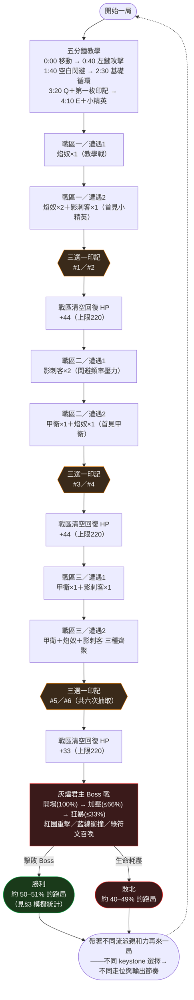

# 《餘燼決鬥場》Gate 2 設計簽核材料

彙整者：Studio Head　日期：2026-07-30
用途：供人類判斷「核心循環成不成立」並拍板放行／退回。本文件不代表通過，`design_signoff` 拍板權在人類。

來源文件：`design/spec.md`、`design/competition-audit.md`、`sim/reports/2026-07-30-gate-2-feasibility.md`（下稱〈可行性報告〉）、`sim/reports/2026-07-30-twin-core-diagnosis.md`（下稱〈雙核診斷報告〉，是現行 content 內容的最新獨立重跑）、`content/marks.json`、`content/enemies.json`、`content/zones.json`。所有數字皆標明出處，無出處數字一律不寫入本文件。

---

## 0. 給人類的決策摘要

本作的核心主張是：三段可打斷近戰連擊＋閃避＋Q/E 兩技能構成的操作基礎上，十二枚餘燼印記中每一枚都直接改寫某個動作的**幾何或規則**，而非只加傷害數字；三條流派（裂焰／影步／守勢）各自的 keystone 印記已用模擬證實會產生彼此不同、方向明確分岔的觸發矩陣與戰鬥剖面（裂焰高引爆傷害、影步高機動反擊、守勢高格擋次數），不是同一套數值換皮。機械式門檻（勝率、流派勝率差、印記出現率下限、Build 集中度、決定性、內容合法性）在最新一次獨立重跑（〈雙核診斷報告〉，30,000 局）中全數通過；唯一未通過的「印記觸發健康度」門檻，是已由 Studio Head 明確裁決保留、留給 Gate 3 真人驗證的**已知限制**（餘波護盾，1.08 次／局），不是未處理的缺陷。

最大的未解風險不在流派差異，而在**整局能不能贏這件事，幾乎完全由一個從未經真人驗證的假設參數（閃避成功率 0.735–0.875）決定**：〈可行性報告〉的敏感度掃描顯示，閃避成功率只要低於 0.6，10,000／30,000 局模擬**沒有一局獲勝**（精確的 0%，非取樣噪聲），而設計區間內部本身勝率就從 7.1% 掃到 91.3%。45–60% 這個「合格」的整體勝率，本質上是對這個 0.14 寬的假設分布取平均後剛好落點，不是遊戲難度曲線本身平緩可容錯的證據。此掃描是在雙核共振修好**之前**的內容版本上做的，尚未在現行內容重跑，方向性結論仍應成立，但這件事本身也提醒：本模型的「哪個數字通過門檻」對內容微調相當敏感。

次要風險：Build 集中度（前五佔比 54.12%，已收緊門檻 ≤58% 內）緊貼門檻、緩衝薄（僅約 4pp）；且分流派拆解後裂焰／影步的 Top-1 build 佔比高達 48%／43%，主要由三枚零前置印記的結構性優勢造成，不是流派強弱問題，但代表玩家在同流派內的選擇多樣性可能不如全域數字看起來的健康。另有一枚印記（餘波護盾）與一項操作鍵數準則（WASD＋左鍵＋空白＋Q/E 共 5 類輸入，超出既有品味準則「最多 3 鍵」的字面上限）目前是刻意接受的已知落差，非隱藏問題。

**建議：有條件放行進入 Vertical Slice，但需將「真人閃避成功率量測」列為 Gate 3 第一優先驗收項**，且餘波護盾的真人策略驗證、Build 集中度的真實抽取分布，都需要在 Gate 3 一併重新量測，不得視為 Gate 2 已經解決。是否放行、放行的條件是否足夠，由人類裁定。

---

## 1. 核心循環流程圖

**單局節奏**：7 場戰鬥（6 場遭遇＋1 場 Boss）、6 次三選一，設計目標時長 15–20 分鐘（模擬中位數 15.58–15.67 分鐘，見 §3）。

**為什麼想再來一局**：玩家每局只能實際拿到約 6 枚印記（12 枚池子裡的一半），且多數印記需要先選 keystone 才會出現在抽取池，所以同一次遊玩幾乎不可能看完三條流派；下一局選擇不同的 keystone 起手（餘燼核心／精準殘影／蓄能反震）會讓普攻、閃避、Q、E 的實際玩法整套改變，而非只是換皮數值。模擬證實三條流派會產生彼此不同的傷害／承傷／格擋剖面（見 §2、§3），這是重玩動機的機制基礎；但這個「感覺想再玩一次」本身是感受層問題，無頭模擬無法直接證明，仍需 Gate 3 真人驗證。

---

## 2. 三流派差異表

三條流派各有一枚 **keystone 印記同時重寫「閃避」與一項主動技能（Q 或 E）**，這是本案對外主張的差異化核心，也是 `design/competition-audit.md` 判定唯一還沒被競品同時滿足的窄定位條件之一。以下表格逐條回答「它如何改變玩家在場上的攻擊／閃避／技能行為」，並誠實標出偏向數值調整而非幾何改寫的部分。

### 裂焰（ember）

| 印記 | 改變的動作 | 行為層面的改變（非數值層面） | 是否偏數值 |
|---|---|---|:---:|
| **餘燼核心**（keystone） | 閃避＋Q | Q 從「位移突進斬」變成「在固定座標放置延遲武裝的餘燼核」；閃避的**位移路徑本身**在核心存在時從直線變成朝核心彎曲的弧線，掃過才引爆。因果方向與 Windblown／Pathogenic 的「閃避本身自動生成拖尾」相反（見 `competition-audit.md`）。 | 否，形狀與路徑都變了 |
| 裂焰連擊 | 普攻第三段 | 第三段從單體突刺變成 120° 扇形範圍判定，用於清理環繞雜兵；刻意不引爆核心（避免與 E 路徑打架）。 | 否，判定形狀改變 |
| 雙核共振 | Q（需先選餘燼核心） | 同時可武裝核心數上限提高到 2；Q 冷卻專屬縮短為 2 秒。改變的是「同時經營幾個引爆點」的空間佈局節奏，而非單純加傷害。 | 部分偏數值（冷卻與機率調整），但前提是雙核心的空間佈局決策 |
| 餘燼獻祭 | E（需先選餘燼核心） | E 從「需要精準閃避時機」變成「一鍵引爆全部」，移除了操作技巧門檻換取穩定性，冷卻拉長且不給加成——是操作決策的取捨改變（要不要練走位），非單純加傷害。 | 否，是操作路徑的取捨 |

### 影步（shadow）

| 印記 | 改變的動作 | 行為層面的改變 | 是否偏數值 |
|---|---|---|:---:|
| **精準殘影**（keystone） | 閃避＋E | 只有落在攻擊判定生效前 0.12 秒的「精準閃避」才觸發，成功時留下殘影並為 E 充能；E 從「破隙衝擊」變成「瞬移到殘影位置」，把技能從固定範圍傷害改成空間傳送＋範圍傷害。 | 否，技能的空間性質整個改變 |
| 突進追擊 | 普攻第一段 | 精準閃避後 1 秒內，第一段從橫斬變成突進突刺（判定範圍變窄、位移距離變化）。 | 否，判定形狀與位移改變 |
| 虛影重置 | 閃避 | 精準閃避冷卻歸零可連續使用，但一般閃避冷卻拉長（1.1→1.4 秒）。**這一枚主要是冷卻時間的數值調整**，沒有改變閃避本身的路徑或判定形狀，只改變「使用頻率」。 | **是，偏數值**——本表誠實標示：這是流派內相對較弱的「改幾何」案例 |
| 暗影收割 | Q（需先選精準殘影） | Q 從突進斬變成「對所有現存殘影同時觸發範圍爆裂，不消耗殘影」，讓玩家在「Q 範圍點殺」與「E 瞬移單體」間依殘影數量決定要用哪個技能。 | 否，是資源分配決策改變 |

### 守勢（guard）

| 印記 | 改變的動作 | 行為層面的改變 | 是否偏數值 |
|---|---|---|:---:|
| **蓄能反震**（keystone） | 閃避＋E | 閃避動作本身的時間軸改變：無敵幀結束後新增 0.15 秒格擋判定尾段（原本閃避結束即可自由行動）；E 從固定傷害變成「6×蓄能層數」的層數兌現機制。 | 否，閃避的判定時間軸結構改變 |
| 餘波護盾（需先選蓄能反震） | 閃避 | 蓄能滿 3 層時，閃避尾段格擋**必定**成功（即使時機已來不及），是「屏住層數換保底」vs「立即用 E 換傷害」的資源取捨。**設計上被 Studio Head 明確駁回過一次「改成純數值」的重新設計版本**（機率×減傷公式），理由正是「牴觸沒有一枚是純數值印記的招牌主張」——這件事本身應被視為本案對「不淪為數值加成」這條主張的把關證據，而非隱藏起來。 | 否（且明確拒絕了偏數值的替代設計），但**觸發率極低**（見 §3），實際能否被玩家感知到待 Gate 3 驗證 |
| 鏡甲反傷（需先選蓄能反震） | Q | Q 從突進斬變成 0.5 秒完全格擋姿態（移動鎖定），格下反傷並加蓄能層——是「主動放棄輸出／移動換保底」的行為改變。 | 否，操作型態整個改變 |
| 鐵壁連動（需先選蓄能反震） | 普攻第一段 | 蓄能 ≥2 層時第一段範圍擴大 30%，且 15% 機率「連段不重置」（視為接住完整連擊效率，是節奏改變而非額外傷害——此為 Gate 2 本輪修正的一項實作缺陷，原本誤植為固定加傷害，已修正）。 | 部分偏數值（範圍百分比），但連段不重置是操作節奏機制 |

**誠實結論**：三條流派的 keystone（餘燼核心／精準殘影／蓄能反震）都確實改寫了閃避或技能的**判定形狀、路徑或時間軸**，不是換皮數值——這點有 keystone 觸發矩陣的模擬數據支撐（見 §3.2）。但每條流派裡都至少有一枚非 keystone 印記（虛影重置、雙核共振、鐵壁連動）主要靠**冷卻時間或百分比數值**驅動效果，幾何改寫成分較弱，其中虛影重置最接近純數值調整。這是設計中真實存在的不均勻，Gate 2 材料如實列出，不代表整條流派的差異化主張不成立。

---

## 3. 模擬統計

**seed**：`embers-duel-gate-2-v1`（主模擬，機械式門檻與流派差異驗證皆用此 seed）；`mark-trigger-health-regression`（3,000 局，自動回歸測試專用 seed）。
**局數**：`design/spec.md` 的重現指令用 10,000 局；Balance Engineer 的「house standard」用 30,000 局（下方數字除非特別註明否則皆為 30,000 局）；另有 100,000 局用於檢驗「流派勝率差」這個指標本身的樣本敏感度。

### 3.1 內容版本與數字時效性（讀表前必看）

`content/marks.json` 的雙核共振（`chain_probability_pct` 40→100、新增 `q_cooldown_s: 2`）在 Gate 2 過程中被修改過一次。三份文件測的是不同時間點的內容版本，數字因此不同，以下一律標明出處，不擅自換算或調和：

| 文件 | 內容版本 | 局數 | 整體勝率 | 流派勝率差 |
|---|---|---:|---:|---:|
| `sim/reports/2026-07-30-gate-2-feasibility.md` | 雙核共振修復**前**（`chain_probability_pct: 40`） | 30,000 | 47.14% | 1.63pp |
| `design/spec.md`〈平衡目標區間〉 | 雙核共振修復**後**（Designer 自測） | 未載明局數（沿用 10,000 局重現指令） | 51.36% | 約 5.2pp（本次量測） |
| `sim/reports/2026-07-30-twin-core-diagnosis.md` | 雙核共振修復**後**（Balance 獨立重跑，現行 `content/marks.json` 狀態） | 30,000 | 50.80% | 4.95pp |

Designer 自報數字（51.36%）與 Balance 獨立重跑數字（50.80%）相差 0.56pp——同一 seed 理論上應完全決定性重現，此處差異未被任何一份文件解釋（可能是局數或執行時機差異）。**本節以下統計採用 `twin-core-diagnosis.md` 的 30,000 局獨立重跑數字為主**，因為它是最新一次對現行內容的獨立驗證。

### 3.2 整體勝率、三流派勝率與差距

來源：`sim/reports/2026-07-30-twin-core-diagnosis.md`，現行內容，30,000 局。

| 指標 | 數值 | 門檻 | 判定 |
|---|---:|---:|---|
| 整體勝率 | **50.80%** | 45%–60% | 通過 |
| 裂焰勝率 | 53.91% | — | — |
| 影步勝率 | 49.50% | — | — |
| 守勢勝率 | 48.96% | — | — |
| 流派勝率差（max−min） | **4.95pp** | ≤15pp | 通過 |

**樣本敏感度提醒**（來源：`gate-2-feasibility.md`〈統計穩定性〉）：流派勝率差這個指標本身對局數很敏感——同一批（修復前）內容在 10k／30k／100k 局分別測得 0.69pp／1.63pp／2.49pp，隨局數持續爬升，代表 10,000 局對此指標噪聲仍偏大。Designer 在 `spec.md` 引用的「0.56pp」本身就是小樣本巧合，不應當精確值使用。修復後的 4.95pp 是否也有類似的樣本數效應，**未見任何文件對現行內容做 100,000 局交叉驗證**——報告未涵蓋，不代為推算。

**三流派是否機制分岔而非數值換皮**：keystone 觸發矩陣（來源：`gate-2-feasibility.md`，30,000 局，修復前內容但機制結構未變）——

| 玩家流派親和力 \ keystone 平均觸發次數／局 | 餘燼核心 | 精準殘影 | 蓄能反震 |
|---|---:|---:|---:|
| 裂焰 | **25.50** | 8.56 | 6.74 |
| 影步 | 11.62 | **24.27** | 7.24 |
| 守勢 | 8.04 | 4.72 | **26.94** |

三流派的戰鬥剖面（同來源）：

| 流派 | 平均造成傷害 | 平均承受傷害 | 平均格擋次數 |
|---|---:|---:|---:|
| 裂焰 | 5518.1 | 296.0 | 0.06 |
| 影步 | 5488.6 | 294.9 | 0.15 |
| 守勢 | 5438.4 | 299.5 | **1.07** |

守勢的格擋次數是裂焰的 17 倍——三流派確實驅動不同的戰鬥機制，對角線觸發次數明顯高於離對角線（2.7–5.7 倍），已寫入自動化回歸測試斷言。

### 3.3 Build 集中度與多樣性

來源：`gate-2-feasibility.md`（修復前內容，30,000 局）與 `twin-core-diagnosis.md`（修復後現行內容，30,000 局）。

| 抽取模式 / 拆解層級 | 前 1 佔比 | 前 5 佔比 | 備註 |
|---|---:|---:|---|
| 現行流派親和力加權（修復前） | 16.21% | 54.65% | `gate-2-feasibility.md` |
| 隨機抽取基準線（無流派偏好） | 11.13% | 42.10% | 池子規模本身的結構性天花板 |
| 樸素均勻基準線（72 種相異 build） | — | 6.94% | 理論下限，僅供對照 |
| **全域現行（修復後）** | — | **54.12%** | `twin-core-diagnosis.md`；門檻 ≤58%（已收緊），通過但緩衝僅約 4pp |

分流派拆解（來源：`twin-core-diagnosis.md`，修復後）：

| 流派 | 該流派可達 build 數 | Top-1 佔比 | Top-5 佔比 |
|---|---:|---:|---:|
| 裂焰 | 24 | **48.16%** | 81.92% |
| 影步 | 24 | **42.74%** | 82.79% |
| 守勢 | 24 | 24.55% | 79.56% |

**支配性選項提醒（結構性而非數值強度）**：裂焰連擊、突進追擊、虛影重置三枚零前置、零 slot 限制的印記，出現率約 **85%**（來源：`gate-2-feasibility.md`），近乎每局必選。報告明確指出這不是因為它們特別強——`draftScore`（三選一抽取評分邏輯）**完全不評估印記的實際戰鬥強度**，只評估結構可達性（前置解鎖、slot 是否被占用）＋流派親和力噪聲。這三枚零門檻印記在影步佔 2/4、裂焰佔 1/4、守勢佔 0/4，密度不對等，是裂焰／影步 Top-1 佔比偏高、Build 集中度緩衝薄的主要結構成因。**這代表「出現率」「集中度」這兩個指標量的是可達性，不是玩家覺得好不好用**——報告對此有明確保留。

### 3.4 印記選取率與觸發率——廢物選項與支配性選項

來源：`gate-2-feasibility.md`（出現率為修復前後不受影響的結構性數字，雙核共振觸發率已依 `twin-core-diagnosis.md` 更新為修復後現行數值）。判準：選取後每局平均觸發 <3 次視為廢物選項。

| 印記 | 流派 | 出現率（30,000 局） | 每局觸發次數（選取時平均） | 判定 |
|---|---|---:|---:|:---:|
| 裂焰連擊 | 裂焰 | 85.05% | 100.65 | 健康 |
| 虛影重置 | 影步 | 85.00% | 26.55 | 健康 |
| 突進追擊 | 影步 | 85.08% | 25.00 | 健康 |
| 鏡甲反傷 | 守勢 | 28.01% | 39.19 | 健康 |
| 暗影收割 | 影步 | 20.95% | 33.90 | 健康 |
| 餘燼核心 | 裂焰 | 49.98% | 30.22 | 健康 |
| 蓄能反震 | 守勢 | 44.94% | 30.21 | 健康 |
| 精準殘影 | 影步 | 35.59% | 35.21 | 健康 |
| 鐵壁連動 | 守勢 | 39.31% | 11.60 | 健康 |
| 餘燼獻祭 | 裂焰 | 19.47% | 12.81 | 健康 |
| **雙核共振** | 裂焰 | 45.66% | 0.63（修復前）→ **15.19–15.35**（修復後，來源：`twin-core-diagnosis.md`） | 修復前為廢物選項，**修復後健康** |
| **餘波護盾** | 守勢 | 39.28% | **1.08**（全域）／0.37–1.30（依流派，來源：`twin-core-diagnosis.md`） | **廢物選項（已知限制，見下）** |

印記出現率下限：`gate-2-feasibility.md`（修復前）為 19.47%（餘燼獻祭）；`design/spec.md` 自報（修復後）為 17.3%（暗影收割）；`twin-core-diagnosis.md`（修復後獨立重跑）為 18.07%（未載明對應印記名稱）。三者皆通過 ≥15% 門檻，但三個數字彼此不一致，反映的是抽取受其他印記解鎖狀態連動影響、且非完全決定於單一因素——不擅自調和，如實並陳。

**餘波護盾為何是已知限制而非待修缺陷**：Balance 診斷根因是蓄能反震自己的 E 只要層數 >0 就會自動施放並清空層數（原型 AI 的固定規則），約 45% 的滿層視窗在接受任何攻擊判定考驗前就被自己的 E 搶發掉。Balance 測試過兩種「修法」：(1) 讓 E 改成滿層才自動施放——結果觸發率反而惡化到 0.74（因為滿層當輪就被同時搶發，視窗更短）；(2) 把觸發門檻從 3 層降到 2 層——觸發率達標（3.73），但整體勝率衝到 56.12%、流派勝率差衝到 16.95pp（**雙雙突破 Gate 2 門檻**）。Designer 曾提出改為「機率×減傷」的純數值重新設計版本（可讓數字達標），但 **Studio Head 已明確駁回**，理由是這會讓 `changes_actions: ['dodge']` 變成假 metadata、且是指標driven而非設計driven的純數值印記，牴觸本案「沒有一枚是純數值印記」的核心主張。目前的裁決是：**保留原始設計、承認觸發率低於健康門檻、登記為「原型 AI 缺乏『屏住層數』策略選項」的模型限制，留給 Gate 3 真人測試真正的效用**。這是一個經過兩輪測試、有明確記錄的裁決，不是被忽略的問題。

### 3.5 閃避成功率敏感度（本案最大風險，見 §0）

來源：`gate-2-feasibility.md`，10,000 局／點，修復前內容（此掃描未在雙核共振修復後的現行內容重跑，報告未涵蓋）。

| 閃避成功率（playerSkill） | 是否在設計區間內 | 勝率 |
|---:|:---:|---:|
| 0.50 | 否 | 0.00% |
| 0.60 | 否 | **0.00%（精確的 0，非取樣噪聲）** |
| 0.70 | 否 | 1.78% |
| 0.735（區間下限） | 是 | 7.10% |
| 0.80 | 是 | 41.34% |
| 0.875（區間上限） | 是 | 91.29% |
| 0.90 | 否 | 97.80% |

45–60% 的整體勝率是對 `playerSkill ~ U(0.735, 0.875)` 這個假設分布取平均的結果，**這個分布本身沒有任何真人資料驗證**。報告測試過用提高戰區回血量緩解低技巧端（+50% 回血讓 skill=0.735 的勝率從 7.4%→15.7%），但代價是把整體勝率一併推到 58.06%（逼近上限），判定「不划算」，結論是**這不是內容數值能便宜解決的問題**。

### 3.6 決定性 / 可重現性

`gate-2-feasibility.md` 與 `twin-core-diagnosis.md` 皆確認：同 seed 重跑 `runOnce`／`runPrototype` 結果完全相同（`toEqual`）；`determinismRerunMatches: true`；前 32 局的摘要 digest 一致。決定性門檻通過，無疑慮。

---

## 4. 對照品味準則

`studio/taste/principles.md` 目前收錄 **11 條**可檢查準則（檔案內另有 1 個「準則一句話」的填寫範本標頭，非實際準則，不計入）。以下為 Studio Head 於 Gate 2 階段的獨立判定，非直接沿用 `design/spec.md` 自身的對照表。

| # | 準則 | 判定 | 依據 |
|---|---|:---:|---|
| 1 | 自動戰鬥的因果不能只用文字追溯表達 | 無法從設計階段判斷 | 本案非自動戰鬥，原始情境不完全適用；`content/marks.json` 每枚印記都寫了 `visible_feedback` 欄位作為設計承諾，但實際呈現是否讓玩家不看文字就能理解因果，是 Gate 3 才能驗證的呈現品質問題。 |
| 2 | 遊戲主循環不得依賴頁面滾動 | 符合（設計承諾層級） | spec.md 明確承諾單一 1280×720 畫面，設計階段無滾動需求；`document.documentElement.scrollHeight === clientHeight` 的實測留待 Vertical Slice。 |
| 3 | 詞條必須直接演示它如何形成流派與戰鬥結果 | 無法從設計階段判斷 | `marks.json` 每枚印記都有 `trigger`／`effect`／`visible_feedback`／`decision_change` 四欄位，資料結構完整；但三選一畫面實際 UI 是否真的呈現這些資訊、玩家是否真能不讀長句重建因果，是實作與呈現問題，設計階段只能確保資料存在。 |
| 4 | 同一介面不得混用中英文遊戲術語 | 符合 | 全部 `content/*.json` 玩家可見欄位（`name`／描述文字）皆為繁體中文；`id` 為英文但明確標註僅供內部使用，不得顯示。 |
| 5 | 攻擊移動方向不得與玩家應按方向使用相反箭頭語意 | 符合 | 三種敵人與 Boss 的預兆全部使用顏色／光暈／殘影／地面範圍（`telegraph_tell` 欄位），未使用任何方向性箭頭圖形，不存在此準則描述的衝突情境。 |
| 6 | 節奏戰鬥的判定必須由共同拍格驅動 | 無法從設計階段判斷（原情境不適用） | 本案明確非節奏遊戲，此準則的字面情境不適用；沒有可比對的替代機制需要在此驗證。 |
| 7 | 核心操作鍵數必須服從漸進教學與輸入負擔 | **不符合（字面）** | 原始準則的可檢查標準是「戰鬥時刻最多 `←`、`→`、`Space` 三種實體鍵」。本案需要 WASD（4 鍵）＋滑鼠左鍵＋空白＋Q＋E，戰鬥時刻同時可用的實體輸入類別達 8 種，遠超原字面上限。`spec.md` 自己也承認這是「勉強對齊、非字面滿足」，僅援引「漸進教學」的精神面（五分鐘教學逐一導入按鍵）。Studio Head 判定：**精神面的漸進教學確實有做到，但這不等於滿足準則本身可檢查的鍵數上限**，Gate 2 材料應誠實列為不符合字面標準，而非用「精神對齊」淡化差距。是否接受這個落差（動作 RPG 類型慣例 vs 既有準則的鍵數上限）需要人類裁決，這條準則本身可能需要在 retro 時修訂適用範圍。 |
| 8 | 網頁遊戲主要操作不得依賴可被輸入法攔截的字元 | 符合 | 設計承諾全面使用 `KeyboardEvent.code`（非 `event.key`），方向鍵固定備援，且列出四項具體自動測試計畫（含刻意設計的反例測試驗證測試本身有偵測力）。根因（避免輸入法組字攔截）已對齊，實測結果待 Vertical Slice。 |
| 9 | Rogue 構築必須在首輪遊玩中可見並改變操作規則 | 符合 | 教學 3:20–4:10 已安排第一次三選一，發生在首輪遊玩不到 4 分鐘內；任一印記都會改變普攻／閃避／Q／E 其中之一的規則（見 §2），且模擬中 keystone 觸發矩陣證實真的分岔（見 §3.2）。 |
| 10 | Rogue 構築的結果必須留在玩家正在操作的畫面中央 | 符合 | 全部 12 枚印記的 `visible_feedback` 皆描述在角色本體或戰鬥區域內的效果（核心圖示、殘影、護環等），沒有印記把效果表現塞進側欄文字。 |
| 11 | 節奏戰鬥必須有可感知的終曲，而非直接切換畫面 | 無法從設計階段判斷（原情境不適用） | 本案非節奏遊戲，字面情境不適用；spec.md 承諾 Boss 三階段轉換與戰鬥結束都規劃收尾演出，但演出節奏是否真的讓玩家「感知到」，是 Gate 3 呈現問題。 |

**小結**：11 條中，5 條「符合」（設計承諾層級，非最終呈現驗證）、1 條「不符合（字面）」（操作鍵數）、5 條「無法從設計階段判斷」（多數是原本情境不適用於本類型，或屬於呈現品質必須等真人試玩）。沒有為了讓表格好看而把「無法判斷」硬填成「符合」。

---

## 5. Gate 3 待驗清單（本文件彙整重點，非窮舉）

沿用 `design/spec.md` 與兩份模擬報告已列出的項目，此處只重申與本文件判斷直接相關、優先序最高的三項：

1. **最高優先**：真人閃避成功率的實際分布是否落在 0.735–0.875；若明顯偏低，整體勝率可能塌到個位數甚至 0%（見 §3.5 的懸崖），且已驗證「調高回血量」不是划算的緩解手段。
2. 餘波護盾的真人「屏住蓄能層數」策略頻率——本原型的自動施放 AI 無法模擬這個策略，若真人也幾乎不會屏住層數，才需要回頭重新設計此印記（見 §3.4）。
3. Build 集中度與分流派 Top-1 佔比在真人實際抽取行為下是否比本原型簡化 AI（`draftScore` 不評估印記強度）更分散（見 §3.3）。

---

## 附：本文件不做的事

本文件不判定 Gate 2 通過或退回——`studio/autonomy.json` 的 `design_signoff` 是 `human`，拍板權在人類。Studio Head 僅在 §0 給出建議與理由，供人類參考。
